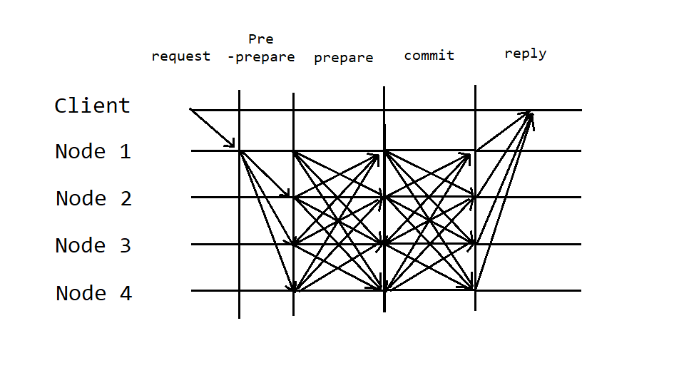
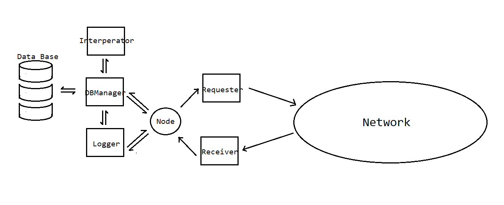
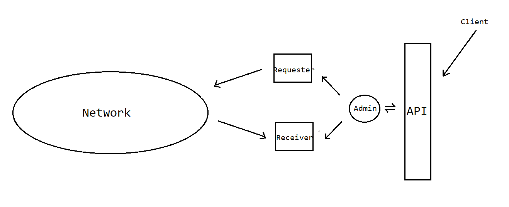

## SmartContract-DistroDB

### Introduction:
A design for distribution database quickly detect and recover the error. Among distribution database, consensus between database is important, sometimes even including the order of the transaction caused by the delay
in the network, withholding attack or deny of service. The system focus on the consensus reaching and recovering the data.

### Technology & Algorithm:
* Hyperledger Composer https://hyperledger.github.io/composer/latest/introduction/introduction.html
* osBrain https://osbrain.readthedocs.io/en/stable/
* Practical Byzantine Fault Tolerance http://pmg.csail.mit.edu/papers/osdi99.pdf
* Merkle tree https://en.wikipedia.org/wiki/Merkle_tree
* Socket programming
* MultiThreading
* MySQL Database

### Consensus & Data Recovery:
Apply practical Byzantine Fault Tolerance Algorithm(simple version and a little modification) to make consensus and Merkle tree structure to check if something wrong in the database and start quickly recovery.
In consensus process, the client sent command to a potential honest node, and this node send the command to others, in pre-prepare stage, nodes would confirm the command they receive and their database condition through Merkletree, if the hash of the root are same, we can make sure that the data base among each other are exactly the same. In prepare stage, nodes get enough confirmation and execute the command, send the hash root of the data base after execution done. Fianly in commit stage, if a node recieve enough confirmation, reply the execution result to the clent.

### Structure:
#### Node Structure:
Node exsist as a manipulator, communicate with DBManager, Logger in software level. DBManager send and get interperated command from the Interperator, and use the command execute operation to the database, besides compute the Merkle tree for the database for quickly recovery and detecting disagreement. Logger is the 'Memory' for the node, record the stage, message sent by the peers, and notify the node to change stage or start requester to send message to the network. Requester and Receiver gets and receive message from the network

#### Admin Structure:
Client commnicate with the API and manipulate the amin node to execute operation to the distribute database. Same, Requester and Reciever 
get and receive message from the network

### Start Guid:
Source code is in https://github.com/WEICANSHI/SmartContract-DistroDB/tree/master/Source/distroDB  
To start a node, code in java with following code  
Node node1 = new Node(1111);  
node1.start();  
node1.ConnectDB("username", "password", "database name", "table name", "url to database");  
After start the node, then could start the admin  
Admin admin = new Admin();  
admin.addNode("node1", "localhost", 1111);  
where parameters are random identifier sign to the node, dns, port number 
To Execute a command, run  
admin.executeCommand(command);  
A test wrote https://github.com/WEICANSHI/SmartContract-DistroDB/tree/master/Source/Test  
Here is a parser for load a simple data(in data file) to the data base
https://github.com/WEICANSHI/SmartContract-DistroDB/tree/master/Source/DatabaseDemo
